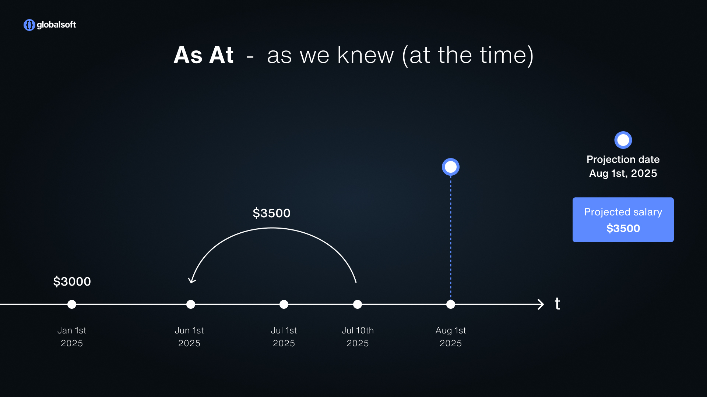
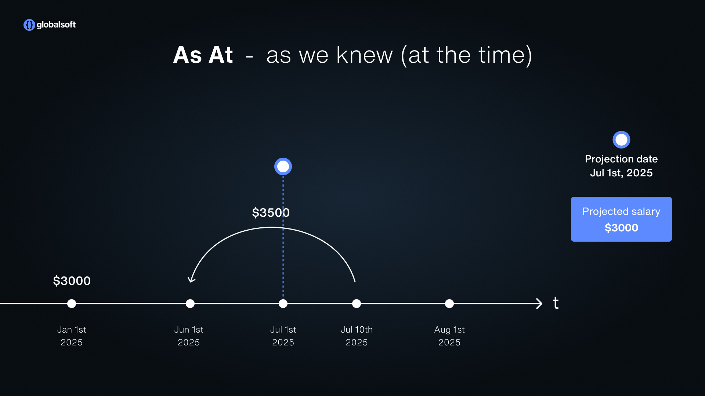
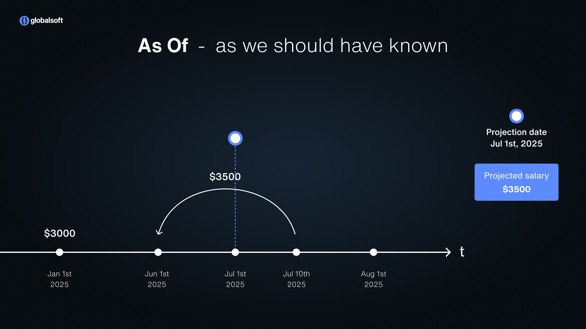
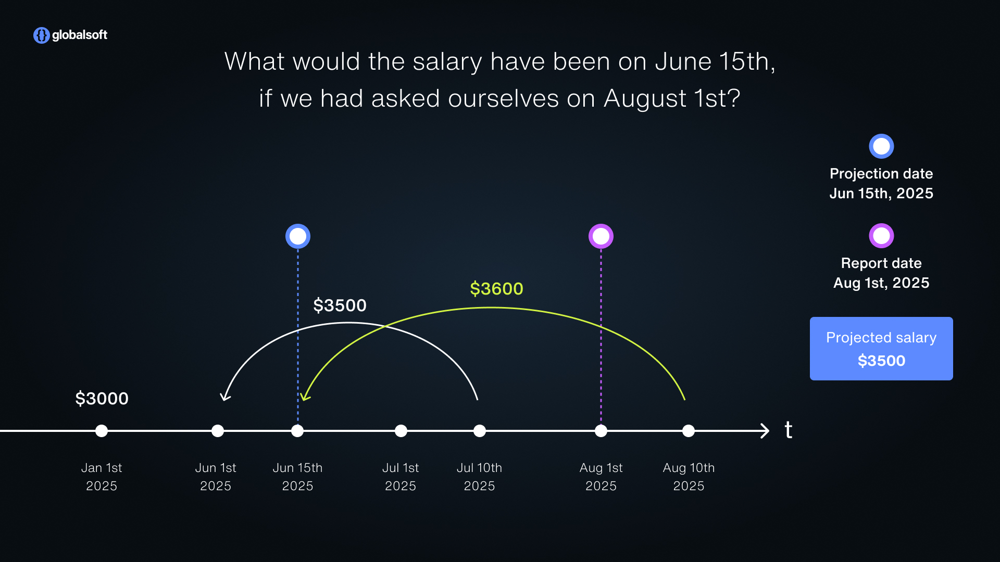

# Go Event Store – Temporal Event Sourcing Done Right


---

## 🧠 Build Systems That Understand Time

**Go Event Store** is a production-ready, **bi-temporal** event sourcing framework for Go. It is designed for systems where historical correctness, explainability, and auditability are critical. By supporting both **Valid Time** and **Transaction Time**, it allows full transparency into what happened, when it was known, and how it evolved.

Traditional event sourcing tracks what *happened*, but not *when we learned it*. Go Event Store's **bi-temporal** approach models:

- **Transaction Time** – When the event was recorded in the system
- **Valid Time** – When the event is *true* in the business domain

This enables historical corrections, scheduling future events, and accurate, auditable timelines — empowering you to build auditable, correctable, and future-aware systems with a clean Go-native API.

---

## 🎯 Use Cases

- **Financial systems** – Ensure auditability, correct past records without fear, and generate reports exactly as they were at any point in time.
- **AdTech platforms** – Track when events actually occurred versus when they were recorded. Bill clients accurately, even when data is late or corrected.
- **Healthcare and legal tech** – Meet strict data retention and traceability requirements while keeping a clear history of all changes.
- **Order management and supply chain tools** – Handle delayed updates, corrections, and future-dated events without compromising data integrity.
- **Pricing engines and configuration tools** – Plan and simulate future prices or contract terms while preserving historical pricing timelines.
- **Analytics and BI tools** – Enable true historical reporting and modeling based on how the data looked at the time, not just how it looks now.

---

## ⚙️ Quick Start

### 📦 Installation
```bash
go get github.com/global-soft-ba/go-eventstore
```

### 🏁 Getting Started with Example

To quickly see Go Event Store in action, check out the [example](https://github.com/global-soft-ba/go-eventstore/tree/main/example) directory in the repository.

This will run a working environment and demonstrate event writing, projection handling, and patching behavior.
You can browse and extend the example for your own use case.

---

## 🚀 Key Features

Go Event Store provides a powerful set of features for time-aware systems:

- ✅ **Bi-Temporal Event Model** – Full support for Valid Time and Transaction Time per event
- ✅ **Advanced Patch Strategies** – Error, Manual, Projected, Rebuild, RebuildSince
- ✅ **Pluggable Persistence Layer** – PostgreSQL, In-Memory, Redis, OpenSearch
- ✅ **Snapshots** – Fast rehydration with patch-safe guarantees
- ✅ **Optimistic Concurrency Control** – Fail (default) and Ignore strategies
- ✅ **Flexible Projections** – Consistent or Eventually Consistent, Single- or Cross-stream
- ✅ **Subscriptions** – Event-type filtering and on-demand replay
- ✅ **Delete Strategies** – NoDelete, SoftDelete, HardDelete

---

# 🏗️ Core Concepts

Go Event Store is more than a persistence engine — it introduces a principled approach to modeling change over time.

Following sections cover the foundational elements that make this possible:

- **Aggregate View**: Load and save event streams with full temporal awareness.
- **Snapshots**: Optimize performance without compromising consistency.
- **Projections**: Build query-ready views from immutable history.

---

## 🧱 Aggregate View

### 🧭 Load Strategies and Temporal Semantics

Go Event Store enables different “views in time” on the same aggregate. This is essential for reporting, debugging, or complying with regulatory standards.

Go Event Store lets you ask "What was true?" from different temporal perspectives:

---

#### 🕒 **AsAt(t)** – What did the system know at time `t`?
Reflects the state without corrections made afterward. Used for audit trails and real-time decisions.  
Useful for real-time decisions or forensics: what information was available at the time of the decision?

- **Scenario:**
    - Projection date is **August 1, 2025**
- **Logic:**
    - “As At” shows the data as the system believed it at a point in time.
    - The system only learned about the raise on **July 10**.
    - So, up to **July 9**: salary was **$3,000**.
    - From **July 10** onward: salary is **$3,500**.
- **Result:**  
  Projected salary: **$3,500**, but the system never assumed it was valid before July 10.



- **Scenario:**
    - Projection date is **July 1, 2025**
- **Logic:**
    - System hadn’t received the correction yet.
    - It only knew of the original salary (**$3,000**).
- **Result:**  
  Projected salary: **$3,000**



---

#### 📜 **AsOf(t)** – What should have been true at time `t`, including retroactive corrections?
This answers the business truth — including any retroactive corrections — and is ideal for financial or legal reconciliation.

- **Scenario:**
    - **January 1, 2025** – Salary was **$3,000**
    - **June 1, 2025** – Employee was entitled to a raise to **$3,500** (**valid time**)
    - **July 10, 2025** – Raise was recorded in the system (**transaction time**)
    - **August 1, 2025** – We want to generate a projection for a report
- **Logic:**
    - Since the correction was entered before the projection date (**August 1**), the system applies the raise retroactively.
    - We project the salary “as we should have known” on **June 1**, using everything we knew up to **August 1**.
- **Result:**  
  Projected salary: **$3,500**


- **Scenario:**
    - Same salary raise, but the projection date is **July 1, 2025**, before the correction was entered.
- **Logic:**
    - The business truth at time **t** is determined with retroactive corrections applied, **regardless of when they were recorded**.
    - The raise is valid from **June 1**, so it applies when evaluating **AsOf(July 1)** even though it was recorded on **July 10**.
- **Result:**  
  Projected salary: **$3,500**



---

#### 📅 **AsOfTill(t, r)** – What was valid at business time `t`, as of report time `r`?
Crucial in reporting pipelines to ensure consistent and explainable outputs over time.

- **Scenario:**
    - We want to know what the salary was on **June 15, 2025** (**value date**)
    - We are asking this question on **August 1, 2025** (**reporting date**)
- **Logic:**
    - Apply all retroactive corrections that were entered **before August 1**
    - Do **not** apply corrections entered **after August 1**
    - In this case, the raise was entered on **July 10**, so it is valid
- **Result:**  
  Projected salary on **June 15**: **$3,500**



---

### 💾 Save Mechanics

Events in Go Event Store are stored as interfaces. The event store itself does not require knowledge of the concrete event types or payloads. This decouples infrastructure from domain logic and allows applications to define their own event types and structures.

The event interface (`IEvent`) defines only temporal and structural metadata (e.g. tenant ID, valid time, transaction time).

It is up to the application to define, implement, and register concrete events and determine what data is stored in each.

#### 📝 Saving Events with Expected Version

Events are saved by providing an expected version of the stream. This allows the store to detect and reject concurrent modifications if the version no longer matches.

#### ⚔️ Concurrent Modification Strategies

These strategies determine how the event store handles version conflicts, which occur when two processes attempt to modify the same aggregate at the same time.

**Why this matters:**  
In distributed or multi-threaded systems, it’s common that multiple updates are attempted simultaneously. If not properly managed, this can result in inconsistent or corrupted aggregate states.

- **Fail (default):** The save operation fails if the version does not match. This ensures strong consistency and avoids unintended overwrites.
- **Ignore:** The store accepts the event and automatically determines the correct version. This is useful in high-throughput systems where occasional overwrites are tolerable and eventual consistency is acceptable.

#### 🗑️ Delete Strategies

These control how delete operations are applied to the event stream. This is particularly important in domains with regulatory or compliance requirements.

- **NoDelete:** Prevents deletion entirely, guaranteeing full audit history.
- **SoftDelete:** Events are flagged as deleted but remain stored and auditable.
- **HardDelete:** Events are permanently removed from the store (e.g., to comply with GDPR).

---

### 🗂️ Snapshots - First Optimization Layer

#### 📌 The Challenge with Snapshots and How Go Event Store Solves It

**Snapshots represent the state of an aggregate at a specific version and time, based on all events up to that point.**

Snapshots are used to improve read performance by storing the latest projection state. However, if a patch is added with a past valid time, the snapshot may become invalid.

**Example:**
- You save a snapshot at version 100.
- Later, you add a patch event with valid time that should have applied at version 50.

If you simply replay *after* the snapshot, you miss the correction entirely! The state will be wrong.

To prevent this, Go Event Store integrates **patch-aware logic** directly into its snapshot mechanism:

- **Patch-Aware Logic** is built-in:
  - Snapshots can only exist in **patch-free intervals**—sections of the timeline with no retroactive events.
  - If a new event is inserted with a valid time that precedes the snapshot, the system **automatically invalidates** the snapshot.
- Snapshots are **tied to aggregate versioning**:
  - A snapshot represents the *state* at a specific version.
  - Events **after** the snapshot are replayed to reach current state.
- Snapshots do **not** increase the aggregate version—they store the version they represent.

#### ✅ What Snapshots Enable

- **Faster Rehydration**: Dramatically reduce the number of events loaded when reconstructing aggregates.
- **Improved Performance**: Lower database I/O and memory usage on reads.
- **Efficient Rebuilds**: Speed up projection rebuilding by using snapshot states as starting points.
- **Predictable Latency**: Ensure consistent load times even for aggregates with thousands of events.

#### 💡 Best Practices

- Choose snapshot frequency based on event stream length and performance needs.
- Ensure snapshot data is **idempotent** and compatible with evolving schemas.
- Monitor patch usage and plan for snapshot invalidation when corrections are applied.
- Combine snapshots with **asOf** / **asAt** semantics to support bi-temporal queries safely.

#### 🔧 Patch Strategies and Their Purpose

These strategies define how the system reacts when an event is inserted at a past point in time:

- **Error**: Rejects the patch. Ensures that once a timeline is sealed, it remains immutable.
- **Manual**: Allows patching but requires a manual rebuild of affected projections.
- **Projected**: Forwards the patch to the relevant projection, assuming it can handle late events.
- **Rebuild**: Triggers a complete projection rebuild.
- **RebuildSince**: Rebuilds only from the time of the patch forward. Optimized for minimal disruption.

**Summary:** Snapshots are essential for scalable event-sourced systems. Go Event Store makes them safe and automatic — even when working with bi-temporal corrections and backdated events.

---

## 📊 Projections – Read Models for Performance

### 🧱 What Are Projections?

**Projections** are a core building block in event-sourced systems. They transform your immutable event streams into *queryable*, *read-optimized* views of the system's state.

By replaying events, projections build materialized views (read models) that can answer business questions efficiently without rehydrating aggregates every time.

Projections keep the read model in sync with aggregates stored in the event store, either by guaranteeing full alignment or by allowing a short-lived drift in favor of performance—depending on the system's consistency and scalability needs.

### ✅ What Projections Enable

- **Read-optimized models**: Tailored schemas for fast querying (SQL tables, NoSQL docs, caches)
- **Denormalization**: Store pre-joined, aggregated or computed fields
- **Materialized views**: Serve data to APIs or UIs in the desired shape
- **Reporting and analytics**: Build OLAP-style tables from event histories
- **Search indexing**: Feed search engines like OpenSearch or Elastic
- **Cross-stream insights**: Combine data from multiple aggregates/streams

### ⚡ Key Features

- **Event Filtering**: Listen only to specific event types.
- **Transactional Updates**: Process all events for a tenant in one DB transaction.
- **Batch Processing**: Define `chunkSize` to control throughput.
- **Rebuilding Support**:
  - Recreate read models by replaying all past events.
  - Background rebuild with minimal downtime.
- **Patch Strategies**:
  - Handle historical corrections (back-dated events) gracefully.
  - Strategies like Error, Manual, Projected, Rebuild, RebuildSince.
- **Subscription Model**:
  - Dynamically register projections.
  - Filter by event type.

### ⏱️ Consistency Models

Go Event Store supports two consistency models for projections:

#### 🔒 Consistent Projections
- Guarantees that the read model and aggregate state are always aligned.
- Every event must be processed by the projection **before** the write operation is considered complete.
- Prevents updates to aggregates unless the projection updates synchronously.
- Ensures correctness but can increase write latency and resource usage.

#### 🚀 Eventually Consistent Projections
- Allows a delay between the write and the projection update.
- For a short window (e.g., milliseconds or seconds), the read model may not reflect the latest write.
- Enables high throughput in systems where temporary staleness is acceptable (e.g., analytics dashboards).

### 🔁 Projection Lifecycle

Projections are defined as Go interfaces that specify how to process events and how to handle rebuilding scenarios. The event store will invoke these during runtime.

```go
type Projection interface {
  ID() string
  EventTypes() []string
  ChunkSize() int
  Execute(ctx context.Context, events []IEvent) error
  PrepareRebuild(ctx context.Context, tenantID string) error
  FinishRebuild(ctx context.Context, tenantID string) error
}
```

Projections should implement the following methods:
- ID(): Unique projection ID
- EventTypes(): List of event types the projection consumes
- Execute(): Called with event batches
- PrepareRebuild() / FinishRebuild(): Setup and teardown logic during a rebuild

#### The lifecycle includes:
- **Initialization**
  - Register the projection with the Event Store.
  - Define consistency, chunk size, timeouts.
- **Execution**
  - Event Store delivers batches of events.
  - Projection processes them and writes to its read model.
- **Rebuild**
  - Supports rebuilding state by replaying the entire event history.
  - Useful after schema changes or bug fixes.

### 🧬 Single Stream vs Cross-Stream Projections

Projections can be based on events from a single aggregate stream or multiple aggregates.

#### 🧾 Single Stream Projections
- These handle events from one specific aggregate (e.g., `User/123`).
- **Advantage**: It becomes possible to rebuild the projection state for just that one entity — efficient and targeted.
- **Status**: *Planned feature.*

#### 🌐 Cross-Stream Projections
- These consume events across many aggregates (e.g., all users, all orders).
- Currently, when one event is patched, **all aggregates are rebuilt** — even if not strictly required.
- **Use cases**: Global statistics, leaderboards, joined data across multiple entities.

### 🛠️ Patch Strategies in Projections

When working with bi-temporal event stores, you have to handle patches — events inserted with back-dated valid time to correct or add to history. This introduces several challenges:

- ✅ A patch might change historical state as of a certain time.
- ✅ Existing projections may now be inconsistent or incorrect.
- ✅ Not all projections want to handle patches the same way.

Different projection types have different tolerance for historical corrections:

- **Audit views** may want to reject any backdated change.
- **Operational projections** might process patches immediately.
- **Analytics pipelines** may prefer queuing patches for batched rebuilds.

To support these diverse needs, Go Event Store allows configuring Patch Strategies per projection — reusing the same mechanisms from the core event store.  
Available configuration values:
- `Error`
- `Manual`
- `Projected`
- `Rebuild`
- `RebuildSince`

See the [Patch Strategies and Their Purpose](#-patch-strategies-and-their-purpose) section for details on each strategy.

Each strategy has different implications for consistency, rebuild cost, and system availability:
- Choose Error for strict, append-only audit logs.
- Use Manual for human-controlled patch processing.
- Prefer RebuildSince for large projections to avoid full replays.
- Ensure projections are idempotent to handle replays safely.

### 💡 Best Practices for Projections

- Design projections to be idempotent.
- Handle out-of-order or duplicate deliveries.
- Use snapshots for large streams to speed up rebuilds.
- Choose consistency level wisely based on business requirements.
- Monitor processing lags to ensure real-time behavior.

---

# 🧩 Specialized Strategies

## ⚡ Ephemeral Events – Efficient Event Handling for High-Volume Domains

In certain use cases, traditional event sourcing — where every event is stored persistently in the corresponding stream — can become inefficient. This typically applies to two scenarios:

- **Event-saturated domains** – Domains that are inherently event-driven (e.g., account transactions) and already manage their own historical traceability.
- **High-frequency systems** – Systems generating extremely large numbers of events, where storing all events can cause significant performance and scalability issues — even when snapshots are used.

### 🛑 Problem

Persisting every single event in these scenarios can lead to:
- Oversized event streams
- Inefficient projection rebuilds
- Storage and performance bottlenecks

### 💡 The Solution: Ephemeral Events

Ephemeral Events allow these domains to maintain the benefits of event-based architecture while avoiding the persistence overhead.

**Key characteristics:**
- Events are versioned and dispatched like normal events.
- They are **not stored** in the event stream.
- Designed to be projected immediately into optimized storage (e.g., partitioned tables, NoSQL stores, caches).
- **Rebuilds** for these projections should be **disabled** (via the projection interface) since the source events are not retained.

### 🛠️ How to Use

Ephemeral event types are defined per aggregate via an initialization option:

```go
eventStore, err, _ := New(adapter,
  WithEphemeralEventTypes("Account", []string{
    "MoneyDeposited",
    "MoneyWithdrawn",
  }))
```

In this example:
- The `Account` aggregate has two event types (`MoneyDeposited`, `MoneyWithdrawn`) marked as ephemeral.
- These events will **not** be saved in the stream but can still be projected.
- Projections for such events should use tailored data models and **must not** support rebuilds.

---

📚 References
- [Martin Fowler: Event Sourcing](https://martinfowler.com/eaaDev/EventSourcing.html)
- [Bi-Temporal Data](https://www.youtube.com/watch?v=xzekp1RuZbM)

👉 Visit the [Product Website](https://www.globalsoft.co/products/event-store)

